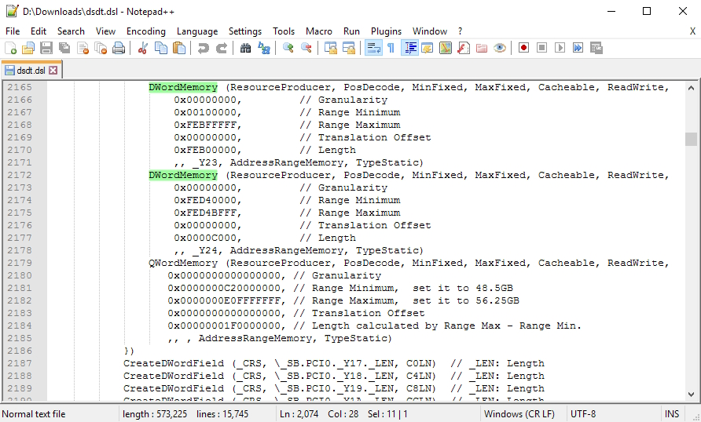
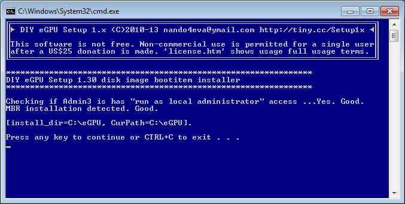
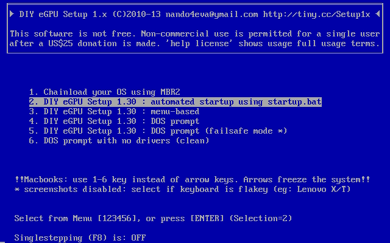
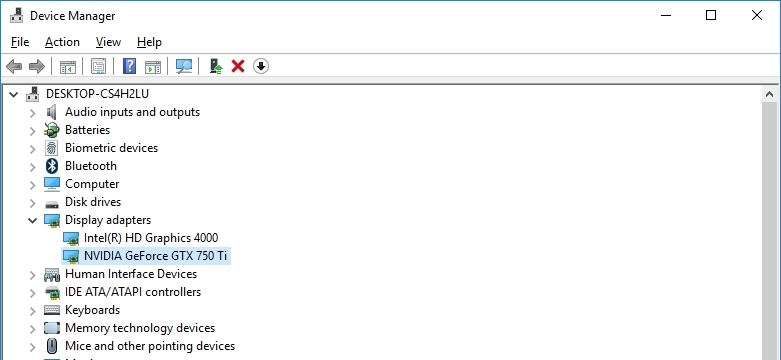

This guide covers the setup of an eGPU system on a Lenovo ThinkPad T530 laptop, running Windows 10. If you're just looking for how to create a DSDT substitution XML file it's [here](#dsdt-substitution-file).
The steps in this guide *should* work on other ThinkPads, and maybe even other brands of laptop. I can't test this to find out.


EDIT: I originally wrote this post **7 years ago**, and then someone on Reddit moaned as this site was down, so I decided to post it again 😊.


## :question: What's eGPU?

A standalone desktop GPU card that connects to a laptop through an external port - that's the 'e' bit in eGPU. You need a special adapter/dock and a cable to attach the GPU to the laptop. For my setup I also needed software to make the operating system recognize the GPU (I'll explain this more later). To power the adapter/dock and GPU, you can either use a desktop (ATX) power supply, or a "power brick" charger[^1].

[^1]: You can only use a power brick charger if the power draw of your system is low enough.

An eGPU adds a boost in graphical performance. Laptops have either integrated (iGPU), or dedicated (dGPU) graphic chips, or sometimes both.
Integrated graphics chips are very basic, they use some of the systems own RAM to operate and are not designed for any heavy lifting, like playing modern games. Dedicated chips mean they have there own RAM, and are more favorable for gaming, **BUT** even high-end dGPUs are still out-performed by low-end GPUs due to the physical limitations inside a laptop. An eGPU works around this limitation and although it has its downsides depending on the setup (e.g., PCIe lanes bottlenecks) it can be a cost effective way of getting a better gaming experience from an older laptop.

People ask the question *&ldquo;Why don't you just build a desktop?&rdquo;*, and well the biggest benefits are _cost_ and _flexibility_.

A new rig is going to set you back _way_ more than an eGPU. The idea is to make use of an old laptop after all. If you invest in a decent card you can always reuse it in a build further down the line.

## :scroll: eGPU requirements

The components of a typical eGPU setup:

1. PCIe x16 full-size desktop graphics card
2. Graphics card adapter/dock
3. Power supply for adapter/dock
4. A laptop with any of these ports: ExpressCard, mPCIe, NGFF, M.2 and Thunderbolt

*Note: The processor will obviously have an effect on eGPU performance, and from what I have read you want at least an Intel Core 2 Duo or the equivalent AMD processor. The newer the better really. I have an Intel Core i5 3320M (3rd gen. Ivy Bridge CPU) which is over 5 years old now, so though it's possible to get a setup working with a Core 2 Duo it's best to stick to something less dated.*

There are numerous adapters on the market for connecting a graphics card to a laptop, and each adapter is available in a variety of different connector types. If your laptop doesn't have any of these ports, then an eGPU setup isn't going to be possible...

This setup uses an ExpressCard port. The ExpressCard slot on my laptop is PCIe x1.2. This means it has 1 lane @ PCIe version 2.0 speeds. This information is very important as bus speed will usually be the bottleneck
in any setup, so knowing this will help you decide if it's going to be worth the effort!

## :hammer: Hardware list

- EVGA GTX 750Ti graphics card
- EXP GDC Beast v8 [ExpressCard version] dock (_banggood.com_)
- 12v DC power brick (_model code: FSP096-AHA_)
- Thinkpad Lenovo T530 with ExpressCard port
- Full-HD external monitor, 1920x1080 resolution[^2]

## :zap: Power supply

The EVGA GTX 750Ti pulls in about 60 watts of power according to the specifications. The PCIe slot on the dock is able to supply 75 watts of power. Therefore, no additional 6-pin PCIe power cable is required.

If you wanted to use a more powerful card you would need the 6-pin PCIe power cable which is available [here for around £4](https://goo.gl/LyqmGN).
The cable connects to the 6-pin (power out) port on the **narrow-side** of the V8 dock. Be careful not to confuse this with the 8-pin (power in) port on the long-side of the dock as this is the port you connect your power supply to if it has a 6-pin connector type.

The power brick adapter I listed is only rated at 96 watts, so you _may_ also need a power supply with a higher wattage if you use a different card. The Dell OptiPlex D220P is a power supply that is recommended often within the eGPU community as they're cheap, relatively small and offer a good amount of power. They're sold on eBay for around £15 and are rated at 220 watts.

[^2]: The monitor isn't required if you have an NVidia-based card and an Intel iGPU that supports Optimus. This will allow you to output the video to your laptops internal display. Note this carries a hefty performance penalty of around 20-30% from what I have read online, and if you factor in bandwidth restrictions when using a single PCIe lane, like in this setup over ExpressCard then this is just not feasible.

## :computer: Software

- [Nando4's DIY eGPU Setup version 1.30 software](https://egpu.io/egpu-setup-13x/) (paid software)[^3]
- [IASL compiler and Windows ACPI tools](https://www.acpica.org/downloads/binary-tools) version 20150619
- [Windows Driver Kit (WDK)](https://developer.microsoft.com/en-us/windows/hardware/windows-driver-kit) version 10.0.14393.0
- A free text editor like [Notepad++](https://notepad-plus-plus.org/download/) to edit some files

[^3]: Nando4's software is now version 1.35, but that won't matter as it's the same software but with added features and bug fixes. **The versions of IASL and WDK are important**. If you are having trouble getting your setup working make sure you use the same version IASL and WDK used in this guide.

## DSDT substitution file

### :warning: Error 12

The dreaded `error 12` in Device Manager? If you've found yourself plugging in your card, dock and laptop and for it not to work, you may need a DSDT substitution. In Device Manager the error details state: `This device cannot find enough free resources that it can use` when you boot up the laptop with the eGPU connected. I did _a lot_ of digging into this issue and found out it was due to the DSDT table being confined to a 32-bit address space. What is a DSDT table? DSDT is the main table within ACPI, which is what determines how devices communicate with each other about power usage. It also does stuff with the configuration of plug n' play devices. The problem is a GPU requires a lot of address space as it happens, more than is available in a 32-bit address space. This is the way it is because hardware manufacturers probably didn't anticipate the addition of other devices on to the system, so there was no need to use a bigger address space. 

The solution to this issue is to create a new DSDT table file that can accomodate other devices and then force the system to use this new address space.

### :books: How to create a new DST file

* Disable Windows 10 from automatically downloading drivers: run `Sysdm.cpl` and click on the "Hardware" tab in the window. Click on "Device Installation Settings" and you want to choose "No" and save the changes

* Run DDU (Display Driver Uninstaller) to delete any NVidia drivers

* Extract the `iasl-win-20150619.zip` file to `C:\`. Make sure the extracted
folder is called `iasl-win-20150619`

* Install `wdksetup.msi` and use the default settings

* Install Notepad++ and use the defaults

* Create a new folder on `C:\` called `DSDT`

* Open a Command Prompt as Administrator and run the following commands in order:

```
SET IASL="C:\iasl-win-20150619\"
SET ASL="C:\Program Files (x86)\Windows Kits\10\Tools\x64\ACPIVerify\"
CD C:\DSDT
```

**Do not close the Command Prompt. If you do don't worry just open it again as an Administrator and run the commands above again.**

* Run this command in the Command Prompt

```
%IASL%acpidump.exe -b
```

Now you have these files: `dsdt.dat`, `facp.dat`, `facs.dat`, `xsdt.dat`. We are only interested in the `dsdt.dat` file.

* Now run this command (as an administrator):

```
%IASL%iasl.exe dsdt.dat
```

The `dsdt.dat` is now decompiled into an editable `dsdt.dsl` file.
**Do not close the command prompt you will need it later**.

* Copy this chunk of code:

```
QWordMemory (ResourceProducer, PosDecode, MinFixed, MaxFixed, Cacheable, ReadWrite,
0x0000000000000000, // Granularity
0x0000000C20000000, // Range Minimum,  set it to 48.5GB
0x0000000E0FFFFFFF, // Range Maximum,  set it to 56.25GB
0x0000000000000000, // Translation Offset
0x00000001F0000000, // Length calculated by Range Max - Range Min.
,, , AddressRangeMemory, TypeStatic)
```

* Open `dsdt.dsl` in Notepad++ or any text editor

* Search for `DWordMemory` and **after** the last entry you want to carefully paste the chunk of code you copied (have a look at the picture it shows you what it should look like)



*	Still in `dsdt.dsl` search for this code:

```
Name (_IRC, 0x00)  // _IRC: Inrush Current
```

You will replace the above code with this code:

```
Method (_IRC, 0, NotSerialized) { Return(0x00) }
```

* Still in `dsdl.dsl` at the top of the file in the `DefinitionBlock` change this:

```
dsdt.aml
```
To this:
```
new.aml
```

Here is a screenshot of what it should look like:


* Now save the `dsdt.dsl` file and close the text editor

* Go back to the Command Prompt again and run this command:

```
%IASL%iasl.exe -oa dsdt.dsl
```

This will compile your `dsdt.dsl` file that you modified and will output `new.aml`. The command should complete without **any** errors, warnings are fine and so is everything else just not any errors.


* Back into the Command Prompt again and run this command:

```
%ASL%asl.exe /u new.aml
```

This takes the `new.aml` file and outputs a `new.ASL` file.

* Open `new.ASL` in a text editor and copy this chunk of code:

```
          Name(_CRS, Buffer(0x1ee)
          {
	0x88, 0x0d, 0x00, 0x02, 0x0c, 0x00, 0x00, 0x00, 0x00, 0x00, 0xff, 0x00,
	0x00, 0x00, 0x00, 0x01, 0x47, 0x01, 0xf8, 0x0c, 0xf8, 0x0c, 0x01, 0x08,
	0x88, 0x0d, 0x00, 0x01, 0x0c, 0x03, 0x00, 0x00, 0x00, 0x00, 0xf7, 0x0c,
	0x00, 0x00, 0xf8, 0x0c, 0x88, 0x0d, 0x00, 0x01, 0x0c, 0x03, 0x00, 0x00,
	0x00, 0x0d, 0xff, 0xff, 0x00, 0x00, 0x00, 0xf3, 0x87, 0x17, 0x00, 0x00,
	0x0c, 0x03, 0x00, 0x00, 0x00, 0x00, 0x00, 0x00, 0x0a, 0x00, 0xff, 0xff,
	0x0b, 0x00, 0x00, 0x00, 0x00, 0x00, 0x00, 0x00, 0x02, 0x00, 0x87, 0x17,
	0x00, 0x00, 0x0c, 0x03, 0x00, 0x00, 0x00, 0x00, 0x00, 0x00, 0x0c, 0x00,
	0xff, 0x3f, 0x0c, 0x00, 0x00, 0x00, 0x00, 0x00, 0x00, 0x40, 0x00, 0x00,
	0x87, 0x17, 0x00, 0x00, 0x0c, 0x03, 0x00, 0x00, 0x00, 0x00, 0x00, 0x40,
	0x0c, 0x00, 0xff, 0x7f, 0x0c, 0x00, 0x00, 0x00, 0x00, 0x00, 0x00, 0x40,
	0x00, 0x00, 0x87, 0x17, 0x00, 0x00, 0x0c, 0x03, 0x00, 0x00, 0x00, 0x00,
	0x00, 0x80, 0x0c, 0x00, 0xff, 0xbf, 0x0c, 0x00, 0x00, 0x00, 0x00, 0x00,
	0x00, 0x40, 0x00, 0x00, 0x87, 0x17, 0x00, 0x00, 0x0c, 0x03, 0x00, 0x00,
	0x00, 0x00, 0x00, 0xc0, 0x0c, 0x00, 0xff, 0xff, 0x0c, 0x00, 0x00, 0x00,
	0x00, 0x00, 0x00, 0x40, 0x00, 0x00, 0x87, 0x17, 0x00, 0x00, 0x0c, 0x03,
	0x00, 0x00, 0x00, 0x00, 0x00, 0x00, 0x0d, 0x00, 0xff, 0x3f, 0x0d, 0x00,
	0x00, 0x00, 0x00, 0x00, 0x00, 0x40, 0x00, 0x00, 0x87, 0x17, 0x00, 0x00,
	0x0c, 0x03, 0x00, 0x00, 0x00, 0x00, 0x00, 0x40, 0x0d, 0x00, 0xff, 0x7f,
	0x0d, 0x00, 0x00, 0x00, 0x00, 0x00, 0x00, 0x40, 0x00, 0x00, 0x87, 0x17,
	0x00, 0x00, 0x0c, 0x03, 0x00, 0x00, 0x00, 0x00, 0x00, 0x80, 0x0d, 0x00,
	0xff, 0xbf, 0x0d, 0x00, 0x00, 0x00, 0x00, 0x00, 0x00, 0x40, 0x00, 0x00,
	0x87, 0x17, 0x00, 0x00, 0x0c, 0x03, 0x00, 0x00, 0x00, 0x00, 0x00, 0xc0,
	0x0d, 0x00, 0xff, 0xff, 0x0d, 0x00, 0x00, 0x00, 0x00, 0x00, 0x00, 0x40,
	0x00, 0x00, 0x87, 0x17, 0x00, 0x00, 0x0c, 0x03, 0x00, 0x00, 0x00, 0x00,
	0x00, 0x00, 0x0e, 0x00, 0xff, 0x3f, 0x0e, 0x00, 0x00, 0x00, 0x00, 0x00,
	0x00, 0x40, 0x00, 0x00, 0x87, 0x17, 0x00, 0x00, 0x0c, 0x03, 0x00, 0x00,
	0x00, 0x00, 0x00, 0x40, 0x0e, 0x00, 0xff, 0x7f, 0x0e, 0x00, 0x00, 0x00,
	0x00, 0x00, 0x00, 0x40, 0x00, 0x00, 0x87, 0x17, 0x00, 0x00, 0x0c, 0x03,
	0x00, 0x00, 0x00, 0x00, 0x00, 0x80, 0x0e, 0x00, 0xff, 0xbf, 0x0e, 0x00,
	0x00, 0x00, 0x00, 0x00, 0x00, 0x40, 0x00, 0x00, 0x87, 0x17, 0x00, 0x00,
	0x0c, 0x03, 0x00, 0x00, 0x00, 0x00, 0x00, 0xc0, 0x0e, 0x00, 0xff, 0xff,
	0x0e, 0x00, 0x00, 0x00, 0x00, 0x00, 0x00, 0x40, 0x00, 0x00, 0x87, 0x17,
	0x00, 0x00, 0x0c, 0x03, 0x00, 0x00, 0x00, 0x00, 0x00, 0x00, 0x10, 0x00,
	0xff, 0xff, 0xbf, 0xfe, 0x00, 0x00, 0x00, 0x00, 0x00, 0x00, 0xb0, 0xfe,
	0x87, 0x17, 0x00, 0x00, 0x0c, 0x03, 0x00, 0x00, 0x00, 0x00, 0x00, 0x00,
	0xd4, 0xfe, 0xff, 0xbf, 0xd4, 0xfe, 0x00, 0x00, 0x00, 0x00, 0x00, 0xc0,
	0x00, 0x00, 0x8a, 0x2b, 0x00, 0x00, 0x0c, 0x03, 0x00, 0x00, 0x00, 0x00,
	0x00, 0x00, 0x00, 0x00, 0x00, 0x00, 0x00, 0x20, 0x0c, 0x00, 0x00, 0x00,
	0xff, 0xff, 0xff, 0x0f, 0x0e, 0x00, 0x00, 0x00, 0x00, 0x00, 0x00, 0x00,
	0x00, 0x00, 0x00, 0x00, 0x00, 0x00, 0x00, 0xf0, 0x01, 0x00, 0x00, 0x00,
	0x79, 0x00
            })
```

Note: This code will vary if you have a different model laptop. This code is what we have been working towards so far in this guide through decompiling, modifying and compiling our DSDT. It's best to save this code for safe keeping (just give it the `.txt` extension when you save.)

* We want to go back to the Command Prompt and run this command:

```
%ASL%asl.exe /tab=DSDT
```

This extracts our 'raw' DSDT in its `.ASL` form (the command creates the `DSDT.ASL` file). The `DSDT.ASL` file is the one actually used by the system without any modification. `new.aml` is the file we modified to get that chunk of code which we now need to add to `DSDT.AML`.

You may be thinking why not just use the modified `new.aml` file instead of creating a new one? Well, through the changes made to `new.aml` it may have introduced errors which will ruin everything, so it's best to generate a new DSDT file from scratch and only change as few parts as possible to maximize an error free file and your sanity.

* Open `DSDT.ASL` in a text editor

* Search for the code:

```
Name(_CRS, Buffer(0x1c0)
```

You will see a big chunk of code like the one you copied. You are going to replace it with what you copied. Be careful not to accidentally remove a curly bracket like one of these: `}`

* Next still in the `DSDT.ASL` file search for this:

```
ATMC()
```

You will need to replace all instances of that with this instead:

```
\_SB_.PCI0.LPC_.EC__.ATMC()
```

* Save and close `DSDT.ASL`

* Open the Command Prompt and run this command:

```
%ASL%asl.exe DSDT.ASL
```

This compiles the `DSDT.ASL` into a `DSDT.AML` file. The `DSDT.AML` file is what we will now use with the DIY eGPU Setup 1.30 software.

### :joystick: Nando4's DIY eGPU Setup 1.3x

You'll need to go and buy [Nando4's DIY eGPU Setup 1.3x](https://egpu.io/egpu-setup-13x/) for the next part of this guide.

* The zip file you receive, unzip it and run the executable which should copy a folder called `eGPU` to your `C:\` drive

* In the `eGPU` folder run the file called `setup-disk-image.bat` and follow the instructions in the window



* Now run the `eGPU-Setup-mount.bat` file. It will mount a drive named `DIYEGPUIMG`

* Navigate to `DIYEGPUIMG` and open the `config` folder and open the `startup.bat` file with a text editor

* At the bottom of the `startup.bat` file add the following code:

```
call vidwait 60
call vidinit -d %eGPU%
call pci
pt MEM writefromfile 1 0xDAFE8000 DSDT.AML
:end
call chainload mbr
```

* Save the `startup.bat` file and close the text editor

* Copy the `DSDT.AML` file from the `C:\DSDT` folder into the `V:\config`
folder

Note: `V:\` is the assigned drive letter when you run the `eGPU-Setup-mount.bat` file. The actual drive letter may vary depending on your system.

* Reboot your computer. Select DIY eGPU Setup 1.30 from the boot menu


* From the menu select option 2: DIY eGPU Setup 1.30 : automated startup using startup.bat. This will force the system to use the 36-bit DSDT and allocate the GPU into it



* When you log back into Windows open Device Manager and on the menu at the top of the window select `View > Resources by type`. If your DSDT substitution was successful you should see a `Large Memory` object


**Success!** All you have to do now is install  the NVidia driver from the website [here](http://www.geforce.com/drivers) (or if you have a different brand of graphics card just have a search for the latest drivers from their website) and reboot your machine again.




The DSDT substitution is only applied until you next reboot your machine, so every time you boot you need to load the DSDT file with DIY eGPU Setup 1.3x to be able to use your graphics card.

